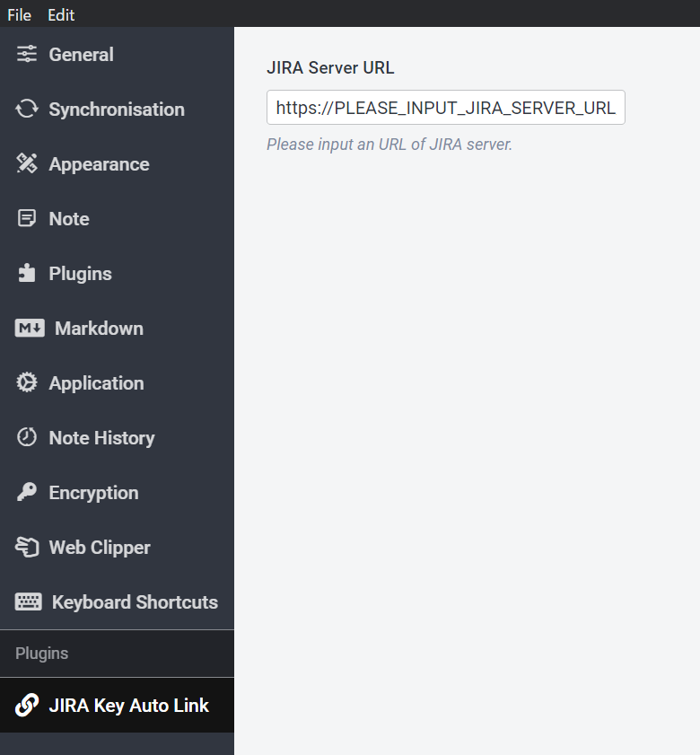

A plugin for Joplin that enables JIRA key auto link.

# Building a plugin
`npm run dist`.

# Installing a plugin
Please see https://github.com/laurent22/joplin/blob/dev/readme/plugins.md.

# Setup a plugin
Please set an URL of JIRA server via options.

